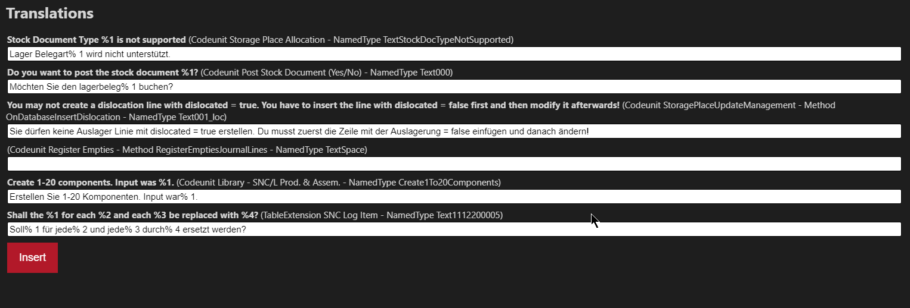

# xliff-tools README

Set the language you want to translate to with SNC: Set translation language.

## Features

Helps you initialize .xlf files if you want to translate into a new language.

Adds new nodes from the english XLIFF file to all your translations. Target nodes included.

Cleanes up legacy target nodes that have no more source nodes.

Helps you translate with a nice WebView. (AI powered translations with Azure Translator can be configured)

